# 🏗️ Architecture Overview

Comprehensive guide to Apache Superset Deploy architecture across all deployment types.

## 📋 Table of Contents

- [Architecture Patterns](#architecture-patterns)
- [Component Overview](#component-overview)
- [Deployment Architectures](#deployment-architectures)
  - [Local Minimal](#local-minimal-architecture)
  - [Local Free Tier](#local-free-tier-architecture)
  - [GCP Free Tier](#gcp-free-tier-architecture)
  - [GCP Standard](#gcp-standard-architecture)
  - [GCP Production](#gcp-production-architecture)
- [Data Flow](#data-flow)
- [Security Architecture](#security-architecture)
- [Networking](#networking)
- [Scalability Patterns](#scalability-patterns)

## 🎯 Architecture Patterns

### Design Principles

1. **Modularity**: Each component is independently scalable
2. **Security First**: Zero-trust networking, encrypted at rest and in transit
3. **Cost Optimization**: Use managed services efficiently
4. **High Availability**: No single points of failure (production)
5. **Observability**: Comprehensive monitoring and logging

## 🧩 Component Overview

### Core Components

| Component | Purpose | Local | GCP Free | GCP Standard | GCP Production |
|-----------|---------|-------|----------|--------------|----------------|
| Superset | BI Platform | Docker | Cloud Run | Cloud Run | GKE |
| Database | Metadata Store | SQLite | SQLite | Cloud SQL | Cloud SQL HA |
| Cache | Performance | None | None | Redis | Redis HA |
| Storage | Files/Assets | Local | Cloud Storage | Cloud Storage | Cloud Storage |
| Monitoring | Observability | Optional | Basic | Prometheus | Full Stack |
| Security | Access Control | Basic | Cloud IAM | Cloud IAM + VPC | Zero Trust |

## 🏠 Local Minimal Architecture

Simplest deployment for testing and development.

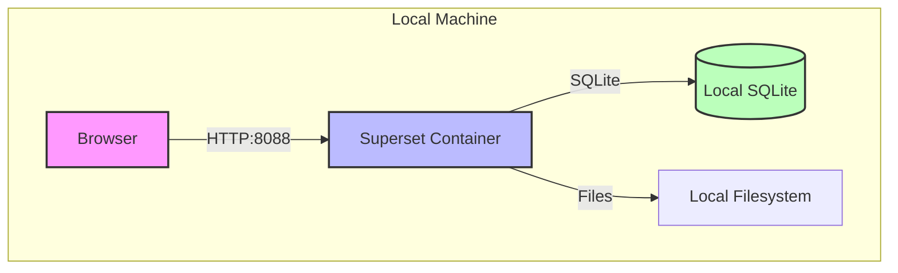

**Characteristics:**
- Single container deployment
- SQLite for metadata
- No external dependencies
- Perfect for testing

## 🆓 Local Free Tier Architecture

Emulates GCP Free Tier constraints locally.

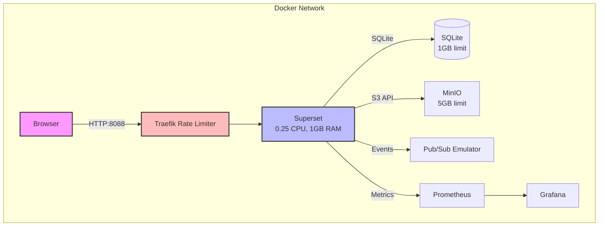

**Free Tier Constraints:**
- CPU: 0.25 vCPU (e2-micro equivalent)
- Memory: 1GB RAM
- Storage: 5GB total
- Requests: 2M/month (rate limited)

## ☁️ GCP Free Tier Architecture

Production-ready deployment at $0/month.

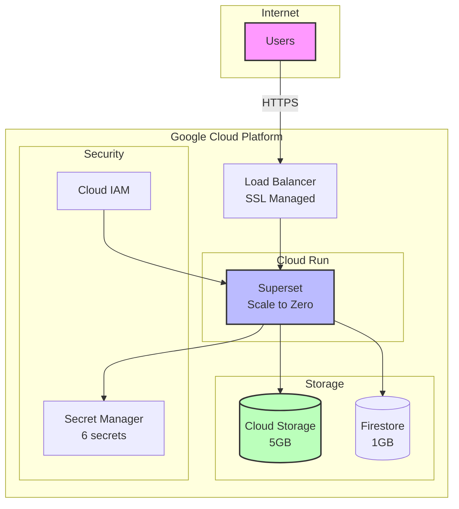

**Key Features:**
- **Scale to Zero**: No charges when not in use
- **Managed SSL**: Automatic HTTPS
- **Firestore**: NoSQL for metadata (1GB free)
- **Cloud Storage**: 5GB for assets
- **Secret Manager**: Secure credential storage

## 🏢 GCP Standard Architecture

Balanced deployment for small to medium businesses.

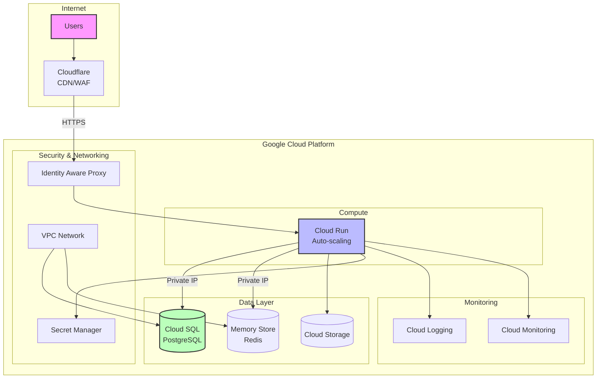

**Enhancements:**
- **Cloud SQL**: Managed PostgreSQL
- **Redis Cache**: Improved performance
- **VPC**: Network isolation
- **Cloudflare**: Global CDN and WAF
- **Auto-scaling**: Handle traffic spikes

## 🚀 GCP Production Architecture

Enterprise-grade deployment with high availability.

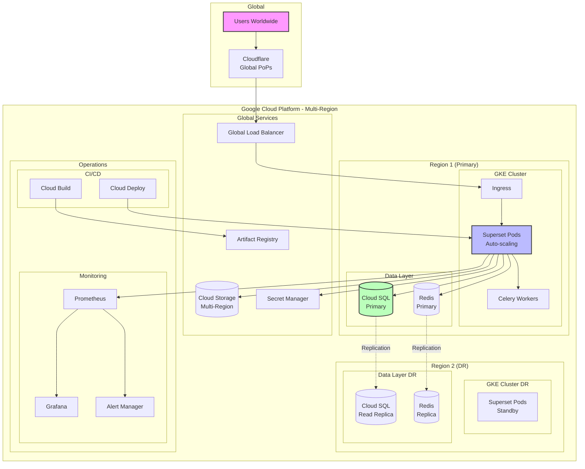

**Enterprise Features:**
- **Multi-region**: Disaster recovery
- **GKE**: Kubernetes orchestration
- **High Availability**: No single points of failure
- **Global Load Balancing**: Low latency worldwide
- **Celery Workers**: Async task processing
- **Full Observability**: Metrics, logs, traces

## 🔄 Data Flow

### Query Execution Flow

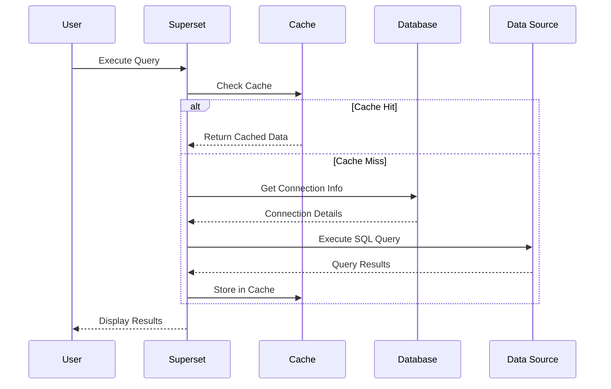

### Authentication Flow (with Cloudflare)

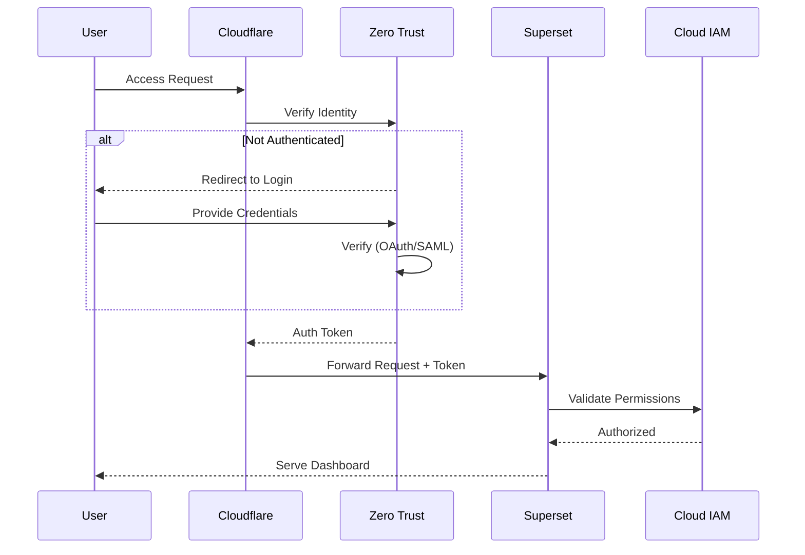

## 🔒 Security Architecture

### Defense in Depth

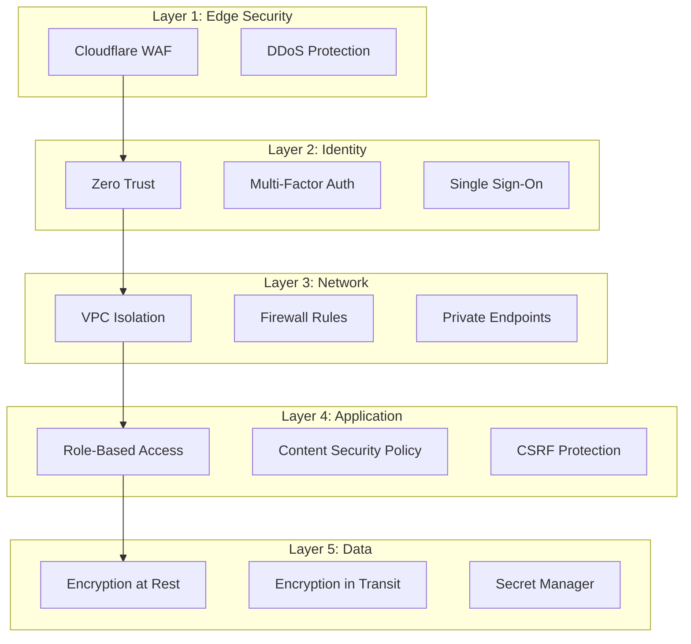

### Security Features by Deployment

| Feature | Local | GCP Free | GCP Standard | GCP Production |
|---------|-------|----------|--------------|----------------|
| HTTPS | Optional | ✓ | ✓ | ✓ |
| WAF | - | - | Cloudflare | Cloudflare |
| Zero Trust | Optional | - | Optional | ✓ |
| VPC Isolation | - | - | ✓ | ✓ |
| Secret Management | .env | Secret Manager | Secret Manager | Secret Manager + KMS |
| Audit Logging | - | Basic | Cloud Logging | Full Audit Trail |
| Backup Encryption | - | - | ✓ | ✓ |

## 🌐 Networking

### Network Architecture

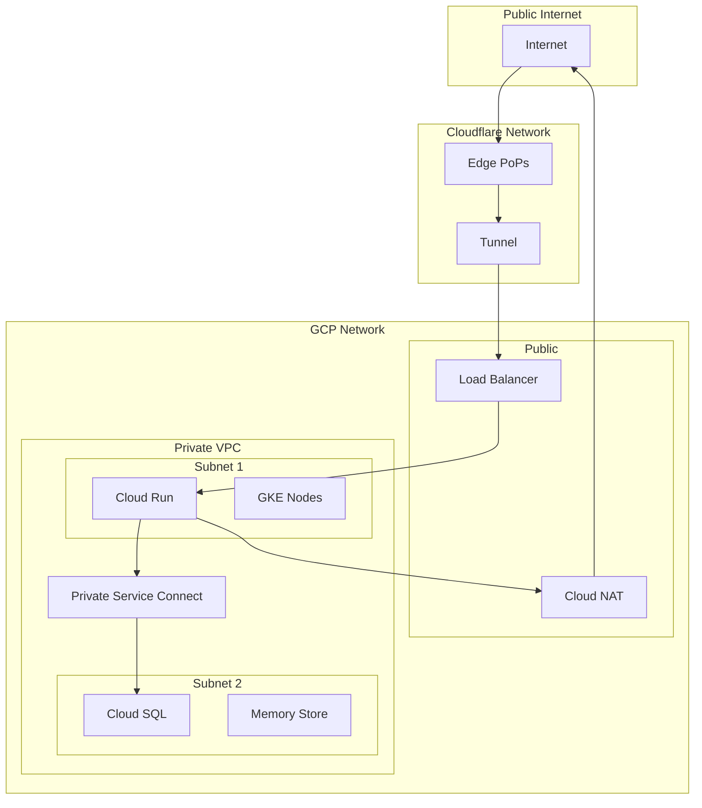

### Network Security Zones

| Zone | Purpose | Access |
|------|---------|--------|
| Public | Load balancers, CDN | Internet |
| DMZ | Application servers | Restricted |
| Private | Databases, cache | Internal only |
| Management | Monitoring, CI/CD | Admin only |

## 📈 Scalability Patterns

### Horizontal Scaling

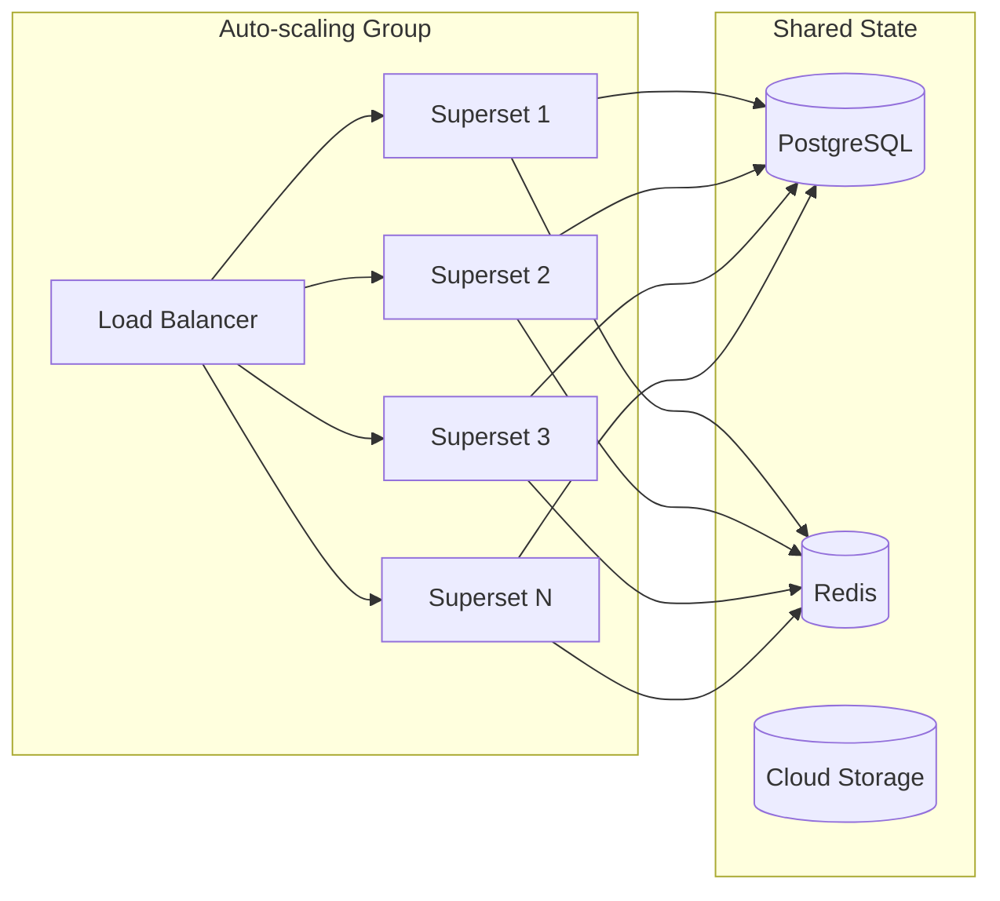

### Scaling Strategies

| Component | Strategy | Trigger |
|-----------|----------|---------|
| Superset | Horizontal | CPU > 70% |
| Database | Vertical → Read Replicas | Connections > 80% |
| Cache | Memory → Cluster | Memory > 80% |
| Storage | Automatic | N/A |

### Performance Optimization

1. **Caching Layers**
   - Browser cache (static assets)
   - CDN cache (Cloudflare)
   - Application cache (Redis)
   - Query cache (Superset)

2. **Database Optimization**
   - Connection pooling
   - Read replicas for analytics
   - Query optimization
   - Proper indexing

3. **Async Processing**
   - Celery for long-running tasks
   - Background report generation
   - Scheduled data refreshes

## 📊 Capacity Planning

### Resource Requirements

| Deployment | Users | Dashboards | Queries/Day | CPU | Memory | Storage |
|------------|-------|------------|-------------|-----|--------|---------|
| Minimal | 1-10 | 10 | 100 | 0.5 | 1GB | 5GB |
| Free Tier | 10-50 | 50 | 1,000 | 1 | 2GB | 10GB |
| Standard | 50-200 | 200 | 10,000 | 4 | 8GB | 100GB |
| Production | 200+ | 1000+ | 100,000+ | 16+ | 32GB+ | 1TB+ |

### Cost Optimization

1. **Use Appropriate Tier**
   - Start with free tier
   - Scale only when needed
   - Monitor usage patterns

2. **Resource Optimization**
   - Enable auto-scaling
   - Use preemptible nodes
   - Implement aggressive caching

3. **Data Management**
   - Archive old data
   - Use data lifecycle policies
   - Optimize query patterns

## 🔗 Integration Points

### External Systems

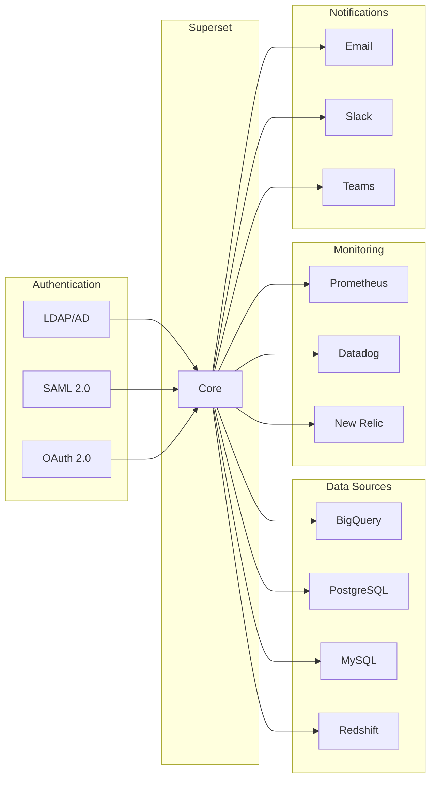

## 🎯 Best Practices

1. **Security First**
   - Enable HTTPS everywhere
   - Use zero-trust networking
   - Implement least privilege

2. **High Availability**
   - No single points of failure
   - Regular backups
   - Disaster recovery plan

3. **Monitoring**
   - Track all metrics
   - Set up alerting
   - Regular performance reviews

4. **Cost Management**
   - Right-size resources
   - Use committed use discounts
   - Regular cost audits

---

**Next Steps:**
- Review [Security Guide](SECURITY.md) for detailed security configuration
- Check [Monitoring Guide](MONITORING.md) for observability setup
- See [Production Guide](PRODUCTION.md) for production checklist