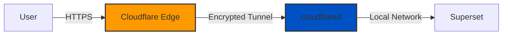

# 🔐 Cloudflare Tunnel Guide

## Overview

Cloudflare Tunnel provides secure access to your Superset deployment without exposing it to the public internet. Best of all, it's **completely FREE** and perfect for our free tier deployment!

## 🆓 Is Cloudflare Tunnel Really Free?

**YES!** Cloudflare Tunnel is free for production use:

| Feature | Free Tier Limit | Cost |
|---------|-----------------|------|
| **Tunnels** | Up to 1000 | $0 |
| **Bandwidth** | Unlimited | $0 |
| **Access Applications** | Up to 500 | $0 |
| **Users** | Unlimited | $0 |
| **Zero Trust Policies** | Unlimited | $0 |

Compare this to alternatives:
- GCP Load Balancer: ~$18/month
- AWS ALB: ~$16/month
- Traditional VPN: $5-50/month

## 🚀 Quick Setup

### Option 1: Through Quick Start (Easiest! 🎉)

```bash
# 1. Run quick start
./quick-start.sh

# 2. When asked "Enable Cloudflare Tunnel?", press 'y'

# 3. Choose how to configure:
#    - Option 1: Create new tunnel (for first-time users)
#    - Option 2: Enter existing token (if you have one)
#    - Option 3: Skip for now

# 4. If you chose option 2, paste your token when prompted
```

### Option 2: Manual Setup

```bash
# 1. Run setup script
./scripts/setup-tunnel.sh

# 2. Choose option 1 (local development)

# 3. Start services with tunnel
docker-compose --profile cloudflare up
```

### Free Tier Deployment

```bash
# 1. Setup tunnel for production
./scripts/setup-tunnel.sh

# 2. Choose option 3 (production) or 4 (custom)

# 3. Configure in system.yaml
cloudflare:
  enabled: true
  tunnel_name: "superset-free"
  hostname: "superset.yourdomain.com"
```

## 🔑 Getting Your Tunnel Token

### From Cloudflare Dashboard
1. Go to [Cloudflare Zero Trust Dashboard](https://one.dash.cloudflare.com/)
2. Navigate to **Access** → **Tunnels**
3. Click on your tunnel name
4. Click **Configure**
5. Copy the token (long string starting with `eyJ...`)

### From Command Line
```bash
# If you have cloudflared installed:
cloudflared tunnel token YOUR-TUNNEL-NAME
```

### Creating a New Tunnel
```bash
# Option 1: Use our script
./scripts/setup-tunnel.sh

# Option 2: Manual creation
cloudflared tunnel login
cloudflared tunnel create my-tunnel
cloudflared tunnel token my-tunnel
```

## 📋 How It Works

1. **No Public IP**: Your Superset instance has no public endpoint
2. **Outbound Connection**: Cloudflared creates an outbound connection to Cloudflare
3. **Secure Tunnel**: All traffic flows through encrypted tunnel
4. **Access Control**: Cloudflare handles authentication before traffic reaches you



## 🔧 Configuration Options

### Basic Configuration (Free Tier)

```yaml
# system.yaml
cloudflare:
  enabled: true
  tunnel_name: "superset-free"
  hostname: "superset.yourdomain.com"
```

### Advanced Configuration (Still Free!)

```yaml
cloudflare:
  enabled: true
  tunnel_name: "superset-production"
  hostname: "analytics.company.com"
  access_policies:
    - name: "employees"
      include:
        - email_domain: "company.com"
        - github_org: "company-github"
      require:
        - mfa: true  # Require 2FA
```

### Multiple Services

```yaml
# docker/cloudflared/config.yaml
tunnel: YOUR-TUNNEL-ID
credentials-file: /etc/cloudflared/credentials.json

ingress:
  - hostname: superset.yourdomain.com
    service: http://superset:8088
  - hostname: grafana.yourdomain.com
    service: http://grafana:3000
  - hostname: prometheus.yourdomain.com
    service: http://prometheus:9090
  - service: http_status:404
```

## 🛡️ Security Benefits

1. **No Attack Surface**: No public IP means no direct attacks
2. **DDoS Protection**: Cloudflare's network absorbs attacks
3. **Zero Trust**: Authenticate users before they reach your app
4. **Audit Logs**: Track who accesses what and when
5. **IP Allowlisting**: Restrict access by location
6. **Device Posture**: Check device security before allowing access

## 💰 Cost Comparison

| Scenario | Without Tunnel | With Tunnel | Savings |
|----------|---------------|-------------|---------|
| **GCP Free Tier** | Need Load Balancer ($18/mo) | Just Cloud Run ($0) | $18/month |
| **Small Business** | LB + Static IP ($23/mo) | Just Cloud Run ($0-5) | $18-23/month |
| **Enterprise** | LB + WAF + DDoS ($200+/mo) | Just Cloud Run ($50) | $150+/month |

## 🔍 Troubleshooting

### Tunnel Not Connecting

```bash
# Check tunnel status
cloudflared tunnel list

# View tunnel logs
docker logs superset_cloudflared

# Test tunnel manually
cloudflared tunnel run YOUR-TUNNEL-NAME
```

### DNS Not Resolving

```bash
# Verify DNS record
dig +short superset.yourdomain.com

# Should return Cloudflare IPs:
# 104.21.x.x
# 172.67.x.x
```

### Access Denied

1. Check access policies in Cloudflare Zero Trust dashboard
2. Ensure user meets policy requirements
3. Check if MFA is required but not configured

## 🎯 Best Practices

1. **Use Zero Trust Policies**: Don't rely on tunnel obscurity
2. **Enable MFA**: Require 2FA for production access
3. **Monitor Access**: Review audit logs regularly
4. **Rotate Credentials**: Regenerate tunnel credentials periodically
5. **Test Policies**: Verify access rules work as expected

## 📚 Additional Resources

- [Cloudflare Tunnel Docs](https://developers.cloudflare.com/cloudflare-one/connections/connect-apps/)
- [Zero Trust Policies](https://developers.cloudflare.com/cloudflare-one/policies/access/)
- [Tunnel Best Practices](https://developers.cloudflare.com/cloudflare-one/connections/connect-apps/best-practices/)

## 🤔 FAQ

**Q: Do I need a Cloudflare account?**
A: Yes, but the free account is sufficient for tunnel usage.

**Q: Do I need to proxy my domain through Cloudflare?**
A: No, you can use Cloudflare Tunnel without proxying your entire domain.

**Q: Can I use this with any domain registrar?**
A: Yes, you just need to add a CNAME record pointing to your tunnel.

**Q: Is there a bandwidth limit?**
A: No, Cloudflare Tunnel has no bandwidth restrictions on the free tier.

**Q: Can I use this for production?**
A: Absolutely! Many companies use Cloudflare Tunnel in production.