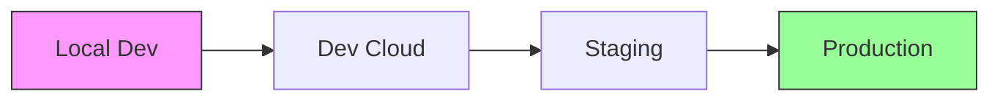
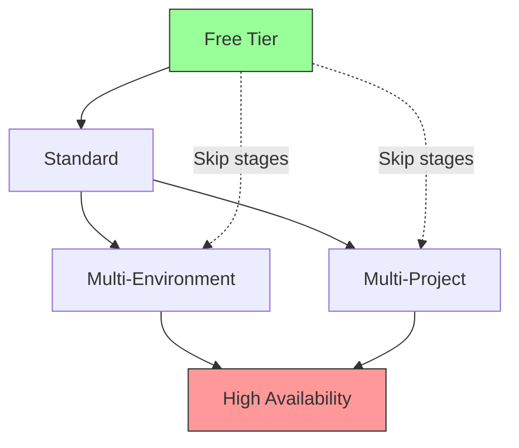

# 📚 Configuration Examples

Complete guide to all example configurations with use cases and cost estimates.

## 📋 Available Examples

| Example | Use Case | Monthly Cost | Complexity |
|---------|----------|--------------|------------|
| [free-tier.yaml](#free-tier-configuration) | Personal projects, testing | $0 | Low |
| [local-deployments.yaml](#local-deployments) | Development, testing | $0 | Low |
| [multi-environment.yaml](#multi-environment) | Dev/Stage/Prod setup | $50-200 | Medium |
| [multi-project.yaml](#multi-project) | Enterprise isolation | $100-500 | High |
| [high-availability.yaml](#high-availability) | Mission critical | $500+ | High |

## 🆓 Free Tier Configuration

**File:** `examples/configs/free-tier.yaml`

### Use Cases
- Personal projects
- Small team dashboards
- Proof of concepts
- Learning and experimentation

### Features
- Cloud Run with scale-to-zero
- SQLite database (via Cloud Storage)
- No Redis cache
- Basic monitoring
- 5GB storage limit

### Example Configuration
```yaml
stacks:
  free-tier:
    type: minimal
    environment: gcp
    enabled: true
    gcp:
      project_id: "my-free-project"
      region: "us-central1"  # Required for free tier
    superset:
      service_type: "cloud-run"
      replicas: 1
      autoscaling:
        min_replicas: 0  # Scale to zero
        max_replicas: 1
      resources:
        cpu: "1"
        memory: "2Gi"
```

### Cost Breakdown
- **Cloud Run**: 2M requests/month free
- **Cloud Storage**: 5GB free
- **Egress**: 1GB/month free
- **Total**: $0/month (within limits)

### Limitations
- 50 hours runtime/month (2GB RAM)
- No high availability
- Limited to 1 instance
- Basic performance

## 🏠 Local Deployments

**File:** `examples/configs/local-deployments.yaml`

### Available Stacks

#### 1. Local Minimal
```yaml
local-minimal:
  type: minimal
  environment: local
  enabled: true
  superset:
    version: "latest"
    port: 8088
    dev_mode: true
```
**Use Case:** Quick testing, learning Superset

#### 2. Local with PostgreSQL
```yaml
local-postgres:
  type: standard
  environment: local
  database:
    type: postgresql
    host: "postgres"
    port: 5432
```
**Use Case:** Testing with real database

#### 3. Local Full Stack
```yaml
local-full:
  type: standard
  environment: local
  monitoring:
    enabled: true
  cache:
    type: redis
```
**Use Case:** Production-like testing

### Docker Resource Limits
```yaml
resources:
  cpu: "2"      # 2 CPU cores
  memory: "4Gi" # 4GB RAM
```

## 🌍 Multi-Environment

**File:** `examples/configs/multi-environment.yaml`

### Use Cases
- Standard software development lifecycle
- Separate environments for testing
- Progressive deployment strategy

### Environment Configuration

#### Development
```yaml
dev:
  type: minimal
  environment: gcp
  gcp:
    project_id: "company-dev"
  superset:
    dev_mode: true
    version: "latest"
```
**Cost:** ~$10/month

#### Staging
```yaml
staging:
  type: standard
  environment: gcp
  gcp:
    project_id: "company-staging"
  database:
    type: cloud-sql
    tier: "db-f1-micro"
  cache:
    type: redis
    tier: "basic"
```
**Cost:** ~$50/month

#### Production
```yaml
production:
  type: production
  environment: gcp
  gcp:
    project_id: "company-prod"
  database:
    tier: "db-n1-standard-1"
    high_availability: true
  monitoring:
    enabled: true
```
**Cost:** ~$200/month

### Migration Path


## 🏢 Multi-Project

**File:** `examples/configs/multi-project.yaml`

### Use Cases
- Enterprise with strict isolation requirements
- Multi-tenant deployments
- Compliance requirements (SOC2, HIPAA)
- Different billing accounts

### Project Structure
```yaml
stacks:
  # Personal development
  personal-dev:
    gcp:
      project_id: "john-dev-project"
      credentials_path: "~/.gcp/personal-key.json"
  
  # Department A
  dept-a-prod:
    gcp:
      project_id: "dept-a-analytics"
      service_account: "superset@dept-a-analytics.iam"
      organization_id: "123456789"
  
  # Department B
  dept-b-prod:
    gcp:
      project_id: "dept-b-analytics"
      service_account: "superset@dept-b-analytics.iam"
      organization_id: "123456789"
```

### Benefits
- Complete isolation between projects
- Separate billing and cost tracking
- Independent security policies
- Different regions possible

### Cost Considerations
- Each project has its own free tier
- Easier budget management
- Department-level chargeback

## 🚀 High Availability

**File:** `examples/configs/high-availability.yaml`

### Use Cases
- Mission-critical dashboards
- 24/7 operations
- Large enterprise deployments
- SLA requirements

### Architecture Features
```yaml
production-ha:
  type: production
  environment: gcp
  gcp:
    regions:
      primary: "us-central1"
      secondary: "us-east1"
  superset:
    replicas: 5
    autoscaling:
      min_replicas: 3
      max_replicas: 20
  database:
    type: cloud-sql
    tier: "db-n1-highmem-4"
    high_availability: true
    read_replicas: 2
  cache:
    type: redis
    tier: "standard"
    memory_size_gb: 13
    high_availability: true
  monitoring:
    enabled: true
    alerting:
      pagerduty: true
      slack: true
```

### HA Components

| Component | Primary | Secondary | Failover Time |
|-----------|---------|-----------|---------------|
| Load Balancer | Active | Standby | < 10s |
| Superset | 3-5 instances | Auto-scale | Instant |
| Database | Primary | Read replicas | < 60s |
| Cache | Primary | Replica | < 10s |
| Storage | Multi-region | Replicated | Instant |

### Cost Breakdown
- **GKE Cluster**: ~$150/month
- **Cloud SQL HA**: ~$200/month
- **Redis HA**: ~$100/month
- **Load Balancer**: ~$25/month
- **Storage/Egress**: ~$50/month
- **Total**: ~$525/month

### SLA Targets
- **Availability**: 99.95% (4.38 hours/year)
- **RPO**: 5 minutes
- **RTO**: 15 minutes

## 📊 Choosing the Right Configuration

### Decision Matrix

| Factor | Free Tier | Standard | Multi-Env | Multi-Project | High Availability |
|--------|-----------|----------|-----------|---------------|-------------------|
| Users | 1-10 | 10-100 | 50-500 | 100-1000 | 500+ |
| Dashboards | 10 | 100 | 500 | 1000 | 5000+ |
| Availability | 95% | 99% | 99.5% | 99.5% | 99.95% |
| Cost | $0 | $50 | $200 | $300 | $500+ |
| Complexity | Low | Medium | Medium | High | High |
| Setup Time | 10 min | 30 min | 1 hour | 2 hours | 4 hours |

### Migration Paths



## 🛠️ Customization Guide

### Adding Custom Features

1. **OAuth Authentication**
   ```yaml
   security:
     oauth:
       enabled: true
       provider: "google"
       client_id: "${OAUTH_CLIENT_ID}"
   ```

2. **Custom Domain**
   ```yaml
   ingress:
     enabled: true
     hostname: "analytics.company.com"
     tls:
       enabled: true
   ```

3. **Data Sources**
   ```yaml
   databases:
     - name: "warehouse"
       type: "bigquery"
       project: "data-warehouse"
     - name: "transactional"
       type: "postgresql"
       host: "10.0.0.5"
   ```

### Performance Tuning

1. **Query Optimization**
   ```yaml
   superset:
     config:
       SQLLAB_TIMEOUT: 300
       SQL_MAX_ROW: 100000
   ```

2. **Caching Strategy**
   ```yaml
   cache:
     default_timeout: 86400  # 24 hours
     query_cache_timeout: 3600  # 1 hour
   ```

3. **Resource Allocation**
   ```yaml
   resources:
     requests:
       cpu: "1"
       memory: "2Gi"
     limits:
       cpu: "4"
       memory: "8Gi"
   ```

## 📝 Configuration Best Practices

1. **Start Small**
   - Begin with free tier
   - Scale based on actual usage
   - Monitor costs daily

2. **Use Version Control**
   - Keep system.yaml in git
   - Tag releases
   - Document changes

3. **Environment Variables**
   - Never hardcode secrets
   - Use `.env` files locally
   - Use Secret Manager in GCP

4. **Testing**
   - Test locally first
   - Validate configuration
   - Have rollback plan

5. **Documentation**
   - Document custom settings
   - Keep runbooks updated
   - Train team on deployment

## 🔄 Example Workflows

### Development to Production

```bash
# 1. Start with local development
make dev ENV=local-minimal

# 2. Test with local PostgreSQL
make dev ENV=local-postgres

# 3. Deploy to dev cloud
make deploy ENV=dev

# 4. Promote to staging
make deploy ENV=staging

# 5. Production deployment
make deploy ENV=production
```

### Cost Optimization Workflow

```bash
# 1. Analyze current usage
./scripts/check-costs.sh

# 2. Identify optimizations
# - Reduce replica count
# - Enable scale-to-zero
# - Use preemptible nodes

# 3. Test changes locally
make validate

# 4. Apply to staging
make deploy ENV=staging

# 5. Monitor impact
gcloud monitoring dashboards list
```

## 🎯 Quick Reference

### Command Cheatsheet

```bash
# Validate configuration
make validate

# Deploy specific environment
make deploy ENV=environment-name

# Check deployment status
make status ENV=environment-name

# View logs
make logs ENV=environment-name

# Destroy deployment
make destroy ENV=environment-name
```

### Environment Variables

```bash
# Required
GCP_PROJECT=your-project-id
SUPERSET_SECRET_KEY=generated-secret

# Optional
SUPERSET_VERSION=5.0.0
DATABASE_PASSWORD=secure-password
REDIS_PASSWORD=secure-password
```

---

**Need Help?**
- Review specific example files in `examples/configs/`
- Check [Architecture Guide](ARCHITECTURE.md) for design details
- See [Troubleshooting Guide](../README.md#troubleshooting)
- Ask in [Discussions](https://github.com/artemiopadilla/superset-deploy/discussions)