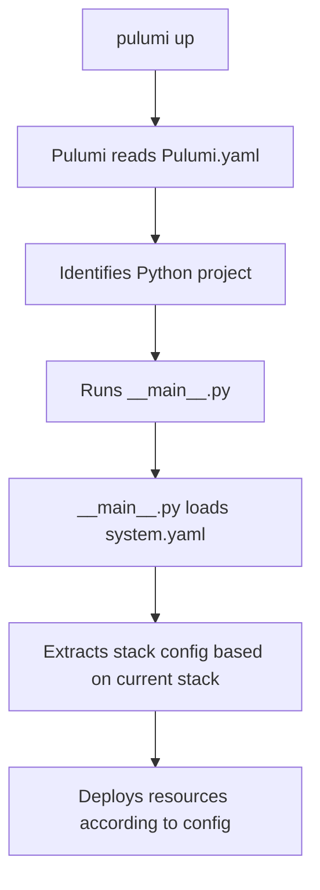

# Understanding Pulumi.yaml vs system.yaml

This guide explains the roles of `pulumi/Pulumi.yaml` and `system.yaml` in the Apache Superset deployment system.

## 📋 Configuration Hierarchy

### 1. **pulumi/Pulumi.yaml** - Pulumi Project Definition
This file defines the Pulumi project itself:
- **Project name**: Identifies the Pulumi project
- **Runtime**: Specifies Python as the language
- **Base configuration**: Defines configuration parameters that Pulumi manages

```yaml
name: superset-deploy
runtime:
  name: python
  options:
    virtualenv: venv
description: Apache Superset deployment on GCP with Pulumi
config:
  gcp:project:
    description: The GCP project to deploy into
  gcp:region:
    description: The GCP region to deploy into
    default: us-central1
```

**Role**: 
- Tells Pulumi this is a Python project
- Defines the structure for Pulumi stack configurations
- Sets up the basic parameters Pulumi needs

### 2. **system.yaml** - Application Configuration
This file contains your actual deployment configurations:
- **Stack definitions**: Multiple environments (dev, staging, production)
- **Resource specifications**: CPU, memory, replicas
- **Service configurations**: Database, cache, monitoring
- **Environment-specific settings**: Different configs per environment

**Role**:
- Defines WHAT to deploy
- Specifies HOW to configure each service
- Controls WHERE to deploy (which GCP project, region)
- Manages application-level settings

## 🔄 How They Work Together



1. **Pulumi.yaml** tells Pulumi this is a Python project
2. Pulumi runs `__main__.py`
3. `__main__.py` loads `system.yaml`
4. Based on the current Pulumi stack name, it finds the matching configuration
5. Resources are created according to the configuration

## 🏗️ Stack Naming Convention

Pulumi stack names follow the pattern: `superset-{environment}`

- Stack name: `superset-dev` → Looks for `dev` in system.yaml
- Stack name: `superset-staging` → Looks for `staging` in system.yaml
- Stack name: `superset-production` → Looks for `production` in system.yaml

## 🔧 Configuration Precedence

1. **Command line arguments** (highest precedence)
   ```bash
   pulumi config set gcp:project my-project
   ```

2. **Pulumi stack configuration** (Pulumi.<stack-name>.yaml)
   ```yaml
   config:
     gcp:project: my-project
   ```

3. **system.yaml** (application configuration)
   ```yaml
   stacks:
     dev:
       gcp:
         project_id: my-project
   ```

4. **Environment variables** (when referenced in system.yaml)
   ```yaml
   project_id: "${GCP_PROJECT:-default-project}"
   ```

## 📝 Summary

- **Pulumi.yaml**: Infrastructure as Code framework configuration
- **system.yaml**: Your application and deployment configuration
- They work together but serve different purposes
- Pulumi.yaml is mostly static, system.yaml changes frequently
- system.yaml provides a higher-level abstraction for managing multiple environments