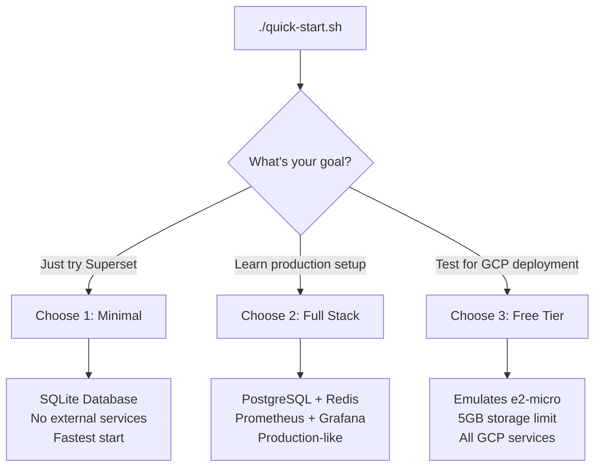

# 🚀 Apache Superset Deploy - Quick Start Guide

Get Apache Superset running in minutes! Choose your path:

## 🎯 Which Configuration Should I Use?

### Quick Decision Guide

Run `./quick-start.sh` and choose:

| Option | Best For | What You Get | Setup Time |
|--------|----------|--------------|------------|
| **1. Minimal** | Quick testing, learning Superset | SQLite only, no dependencies | 1 minute |
| **2. Full Stack** | Production practice, real databases | PostgreSQL + Redis + Monitoring | 3 minutes |
| **3. Free Tier** | Testing before GCP deployment | All services with GCP limits | 5 minutes |

### Detailed Decision Tree



## ⚡ Fastest Start (Under 2 minutes!)

### Interactive Quick Start (Recommended)

```bash
# Clone and run the interactive installer
git clone https://github.com/artemiopadilla/superset-deploy
cd superset-deploy
./quick-start.sh
```

**Choose your setup:**

### 📊 Comparison Table

| Feature | 1. Minimal | 2. Full Stack | 3. Free Tier |
|---------|------------|---------------|---------------|
| **Database** | SQLite | PostgreSQL | SQLite |
| **Cache** | None | Redis | None |
| **Monitoring** | None | Prometheus + Grafana | Prometheus + Grafana |
| **Resource Limits** | None | None | Yes (1GB RAM, 0.25 CPU) |
| **Cloud Emulators** | None | None | Firestore, Pub/Sub, MinIO |
| **Setup Time** | 1 minute | 3 minutes | 5 minutes |
| **Best For** | Quick testing | Production practice | GCP deployment prep |

### Detailed Options:

1️⃣ **Minimal** - Fastest, no dependencies
- 🚀 Ready in 1 minute
- 💾 SQLite database (built-in)
- 🎯 Perfect for testing Superset features

2️⃣ **Full Stack** - Complete production environment
- 🐘 PostgreSQL (production database)
- 🚀 Redis (high-performance cache)
- 📊 Full monitoring stack
- 🎯 Best for learning production setups

3️⃣ **Free Tier Emulation** - Test GCP limits
- 🆓 Emulates exact GCP Free Tier constraints
- 💾 SQLite (GCP free tier has no Cloud SQL)
- 📦 Cloud Storage emulator (MinIO)
- 🎯 Perfect for testing before GCP deployment
- 📖 [See full clarification](FREE_TIER_CLARIFICATION.md)

### Direct Commands (if you know what you want)

```bash
# Minimal setup
make dev

# Full stack
make full-stack

# Stop services
make full-stack-down  # Stop full stack
docker-compose -f docker/docker-compose.minimal.yaml down  # Stop minimal
```

---

## 📦 Full Stack Start (5 minutes)

### Complete Setup with PostgreSQL, Redis & Monitoring

```bash
# One command for the full experience
./quick-start-full.sh
# or
make full-stack

# Access everything:
# - Superset: http://localhost:8088 (admin/admin)
# - Grafana: http://localhost:3000 (admin/admin)
# - Prometheus: http://localhost:9090
```

**Includes:**
- 🐘 PostgreSQL (production database)
- 🚀 Redis (high-performance cache)
- 📊 Prometheus (metrics collection)
- 📈 Grafana (beautiful dashboards)
- 🔍 Exporters (database & cache monitoring)

**Stop the full stack:**
```bash
make full-stack-down      # Stop services
make full-stack-clean     # Stop and remove all data
```

---

## 🆓 Free Tier Quick Start (5 minutes)

### Local Free Tier Emulation - Test GCP Free Tier Limits Locally

```bash
# 1. Clone repository
git clone https://github.com/artemiopadilla/superset-deploy
cd superset-deploy

# 2. Initialize free tier
./scripts/init-free-tier.sh

# 3. Start services
docker-compose -f docker/docker-compose.yaml \
               -f docker/docker-compose.full-free-tier.yaml up -d

# 4. Access services
open http://localhost:8088  # Superset (admin/admin)
open http://localhost:9001  # MinIO Console (minioadmin/minioadmin)
open http://localhost:3000  # Grafana (admin/admin)
```

**Features**: SQLite, 1GB RAM limit, 5GB storage, monitoring included.

---

## ☁️ GCP Free Tier Deployment (10 minutes)

### Deploy to Google Cloud Platform - $0/month

#### Prerequisites
```bash
# Install gcloud CLI (if needed)
curl https://sdk.cloud.google.com | bash

# Login to GCP
gcloud auth login
gcloud config set project YOUR-PROJECT-ID
```

#### Deploy
```bash
# 1. Enable required APIs (2 minutes)
gcloud services enable run.googleapis.com \
                       cloudbuild.googleapis.com \
                       storage.googleapis.com \
                       secretmanager.googleapis.com

# 2. Configure deployment (2 minutes)
cp system.yaml.example system.yaml
# Edit system.yaml: set gcp-free-tier.enabled = true
# Edit system.yaml: set gcp.project_id = "YOUR-PROJECT-ID"

# 3. Deploy with Pulumi (5 minutes)
export GCP_PROJECT=YOUR-PROJECT-ID
make deploy ENV=gcp-free-tier

# 4. Get URL (1 minute)
gcloud run services describe superset \
  --region=us-central1 \
  --format="value(status.url)"
```

**Note**: First deployment takes ~5 minutes. URL will be: `https://superset-xxxxx-uc.a.run.app`

---

## 🏢 Standard Deployment Quick Starts

### Local Standard (with PostgreSQL + Redis)

```bash
# 1. Setup
make setup

# 2. Start with PostgreSQL and Redis
docker-compose -f docker/docker-compose.yaml \
               --profile postgres up -d

# 3. Access
open http://localhost:8088
```

### GCP Standard (Cloud Run + Cloud SQL)

```bash
# 1. Configure
cp system.yaml.example system.yaml
# Edit: set staging.enabled = true

# 2. Deploy
make deploy ENV=staging

# 3. Access via Cloud Run URL
gcloud run services describe superset-staging \
  --region=us-central1 \
  --format="value(status.url)"
```

---

## 🔒 Secure Access with Cloudflare (Optional)

Add zero-trust security to any deployment:

```bash
# 1. Setup tunnel
make setup-tunnel

# 2. For local development
make dev-tunnel

# 3. Access via your domain
open https://superset.yourdomain.com
```

---

## 📊 Cost Calculator

| Configuration | Monthly Cost | Best For |
|--------------|-------------|----------|
| Local Minimal | $0 | Testing, learning |
| Local Free Tier | $0 | Development, free tier testing |
| GCP Free Tier | $0* | Personal projects, small teams |
| GCP Standard | ~$50 | Small-medium business |
| GCP Production | ~$200+ | Enterprise, high availability |

*Free tier limits: 2M requests/month, 50 hours runtime/month

---

## 🚨 Common Issues & Solutions

### Port 8088 Already in Use
```bash
# Find and stop the process
lsof -i :8088
kill -9 <PID>
# Or use different port
SUPERSET_PORT=8089 make dev
```

### Docker Not Running
```bash
# macOS
open -a Docker

# Linux
sudo systemctl start docker
```

### GCP Authentication Error
```bash
gcloud auth application-default login
```

---

## 🎯 Next Steps

1. **Customize Configuration**: Edit `system.yaml` for your needs
2. **Add Sample Data**: `make load-examples`
3. **Configure OAuth**: See [Security Guide](SECURITY.md)
4. **Set Up Monitoring**: See [Monitoring Guide](MONITORING.md)
5. **Production Checklist**: See [Production Guide](PRODUCTION.md)

---

## 📚 More Resources

- **[Full Documentation](../README.md)** - Complete feature list
- **[GCP Free Tier Guide](GCP_FREE_TIER_GUIDE.md)** - Detailed free tier information
- **[Architecture Overview](ARCHITECTURE.md)** - System design details
- **[Examples](EXAMPLES.md)** - Configuration examples
- **[FAQ](FAQ.md)** - Frequently asked questions

---

## 💡 Tips for Success

1. **Start Small**: Begin with local minimal, then scale up
2. **Monitor Costs**: Set up billing alerts for GCP
3. **Use Free Tier**: Perfect for personal projects
4. **Enable Monitoring**: Always know your resource usage
5. **Secure Early**: Set up Cloudflare tunnel for security

---

**Need Help?** 
- 📖 Check the [FAQ](FAQ.md)
- 🐛 [Report Issues](https://github.com/artemiopadilla/superset-deploy/issues)
- 💬 [Discussions](https://github.com/artemiopadilla/superset-deploy/discussions)